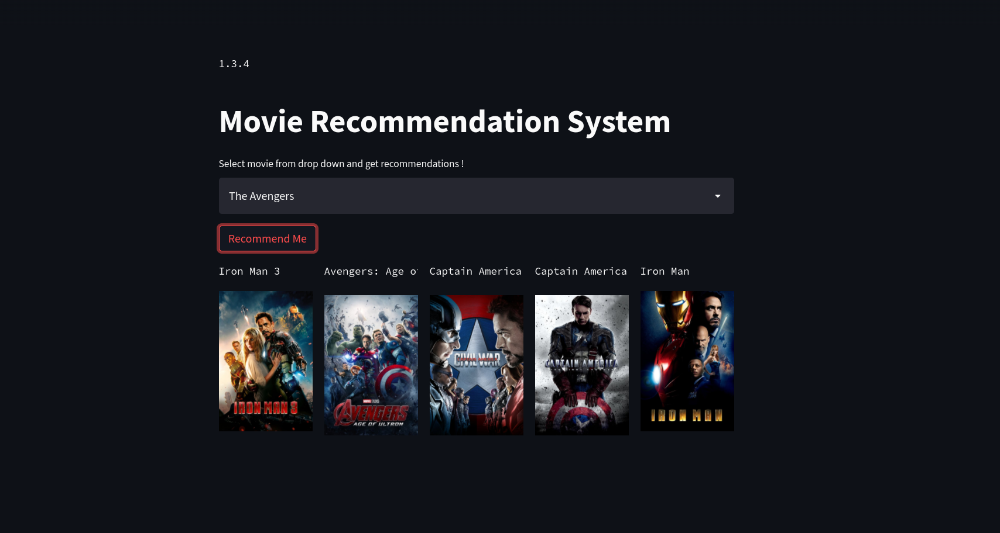

<!-- Add banner here -->

# Movie Recommendation System - End-2-End 

<!-- Add buttons here -->

<!-- Describe your project in brief -->
Simply put a Recommendation System is a filtration program whose prime goal is to predict the “rating” or “preference” of a user towards a domain-specific item or item. In our case, this domain-specific item is a movie, therefore the main focus of our recommendation system is to filter and predict only those movies which a user would prefer given some data about the user him or herself.
<!-- The project title should be self explanotory and try not to make it a mouthful. (Although exceptions exist- **awesome-readme-writing-guide-for-open-source-projects** - would have been a cool name)

Add a cover/banner image for your README. **Why?** Because it easily **grabs people's attention** and it **looks cool**(*duh!obviously!*).

The best dimensions for the banner is **1280x650px**. You could also use this for social preview of your repo.

I personally use [**Canva**](https://www.canva.com/) for creating the banner images. All the basic stuff is **free**(*you won't need the pro version in most cases*).

There are endless badges that you could use in your projects. And they do depend on the project. Some of the ones that I commonly use in every projects are given below. 

I use [**Shields IO**](https://shields.io/) for making badges. It is a simple and easy to use tool that you can use for almost all your badge cravings. -->

<!-- Some badges that you could use -->

<!-- 
: This badge shows the version of the current release.


: I think it is self-explanatory. This gives people an idea about how the project is being maintained.


: This is a dynamic badge from [**Shields IO**](https://shields.io/) that tracks issues in your project and gets updated automatically. It gives the user an idea about the issues and they can just click the badge to view the issues.


: This is also a dynamic badge that tracks pull requests. This notifies the maintainers of the project when a new pull request comes.

: If you are not like me and your project gets a lot of downloads(*I envy you*) then you should have a badge that shows the number of downloads! This lets others know how **Awesome** your project is and is worth contributing to.


: This shows what kind of open-source license your project uses. This is good idea as it lets people know how they can use your project for themselves.

: This is not essential but it is a cool way to let others know about your project! Clicking this button automatically opens twitter and writes a tweet about your project and link to it. All the user has to do is to click tweet. Isn't that neat? -->

# Demo-Preview

<!-- Add a demo for your project -->

<!-- After you have written about your project, it is a good idea to have a demo/preview(**video/gif/screenshots** are good options) of your project so that people can know what to expect in your project. You could also add the demo in the previous section with the product description.

Here is a random GIF as a placeholder.

 -->

# Table of contents

<!-- After you have introduced your project, it is a good idea to add a **Table of contents** or **TOC** as **cool** people say it. This would make it easier for people to navigate through your README and find exactly what they are looking for.

Here is a sample TOC(*wow! such cool!*) that is actually the TOC for this README. -->

- [Project Title](#project-title)
- [Demo-Preview](#demo-preview)
- [Table of contents](#table-of-contents)
- [Tech Stack](#tech-stack)
- [Installation](#installation)
- [Downloads](#downloads)
- [Usage](#usage)
- [Deployment to Heroku](#development)

# Tech Stack
[(Back to top)](#table-of-contents)

Property | Data
--- | --- 
**Language**  | 
**Domain Knownledge**  | [](https://github.com/BEPb/BEPb) 
**CI / CD** |  [](https://github.com/BEPb/BEPb) [](https://github.com/BEPb/BEPb)
**Tools & Platform**  |  
**Machine Learning / Deep Learning frameworks**  | ![Jupyter Notebook](http://img.shields.io/badge/-Jupyter%20Notebook-eee?style=flat-square&logo=data:image/png;base64,iVBORw0KGgoAAAANSUhEUgAAAA4AAAAQCAMAAAARSr4IAAACGVBMVEVhYmJdYWT/fBfzdyaqdlV2dnfcdC9udnz5dyKUaU3wdicCO2CzZzVdUkpOTk5MTk60ZzUAAP/XcC3fcivgciv/lArAajLqdSifYjrydyajnJjEjWifnp3FjGcAAACenp52dnd2dnd2dndhYmJhYmIxW3bzdybzdybzdybzdybzdyb/dxpydnl2dnd2dndhYmJgYmOda0r0dyXzdybzdybzdybudymQdmZldoJQYGmRaU7ydyfzdybzdybzdybzdybzdybzdybzdyb1dyX9dx/2dyXzdybzdybzdyb+eiPzdybzdybzdyb/ghz8eSQ3SFT/tABNTk5HTFBMTk5OTk5OTk5OTk5OTk5OTk5OTk5OTk5OTk5NTk5GTFBOTk5OTk5OTk5OTk5OTk5OTk5OTk5OTk5OTk5OTk5OTk5OTk5OTk5OTk5OTk5NTk5OTk5OTk5OTk5OTk5OTk5OTk5OTk5OTk5NTk5NTk5UUEx5WUMAOGRMTU9OTk5OTk5OTk5OTk5OTk5FTFAXQFvBajK8aTP2eCX0dyb0dyb0dybzdyb4eCXzdybzdybzdybzdybzdybzdybzdybzdybzdyb6dB3zdyXzdybzdybzdybzdybzdybzdybzdyaenp6cn6HKimD0dyXzdybzdybzdybzdybzdybzdyaenp6enp6dn6Dzdybzdyaenp6enp6enp6enp7zdyaenp7///9F1GYlAAAAsHRSTlMAAAAAAAAAAAAAAAAAAAAAAAAAAAAAAAAAAAAAAAAAADHCVho4Ax1RcnFOFz/ibFmwHXPc/thwKwkKJpfbqn1oaX+uighRdSIDAyV6TAQcAgIVHBMbKjIgEzBTHCsbLUBdQlhiTWBlR1xkaEVIR1tPbFEvF0pJNR9AFAQIMwgfKQUDBwgDBEsuMkcCLLSUKBsqT5iwNcX47N/g7cAxPmUqZq/OzaxiExPJYgQPCJjcP9lVnrgAAAClSURBVAjXVcyxSoIBAEXh+xkhEkFr6hD0AM5BkbQ3ODaEY4uDSENCS1BThI/h4v4TERG0NzZHvoAQ0SDV8FvkmS6cw5UgSTR5s83rlgUvWuA8l/Bs59eYbXhS28VdUt1H4dA9Eu1HexUdS3T/7Y81vXJ9rQicLcxoAK64hvd1fWwOeDgoy+JW3bCs56tOonnxd3ycGKt9nt7I91GShgn60yRJI/kBP8EfEEdOa6sAAAAASUVORK5CYII=&logoColor=F37626) 


# Installation
[(Back to top)](#table-of-contents)
```
pip install -r requirements.txt
```
<!-- *You might have noticed the **Back to top** button(if not, please notice, it's right there!). This is a good idea because it makes your README **easy to navigate.*** 
The first one should be how to install(how to generally use your project or set-up for editing in their machine).

This should give the users a concrete idea with instructions on how they can use your project repo with all the steps.

Following this steps, **they should be able to run this in their device.**

A method I use is after completing the README, I go through the instructions from scratch and check if it is working. -->

<!-- Here is a sample instruction:

To use this project, first clone the repo on your device using the command below:

```git init```

```git clone https://github.com/navendu-pottekkat/nsfw-filter.git``` -->

# Downloads
[(Back to top)](#table-of-contents) <br/>
[GoogleDrive](https://drive.google.com/drive/folders/1yq1aPBggcDzBIUXE6DVUY5PGnPcu9DmL?usp=sharing)

* Get the Dataset (or pickle files if do not want to re-create the model)
* Get the Notebook
* Place the dataset in the root directory of notebook
* run it


# Usage
[(Back to top)](#table-of-contents)

```
streamlit run app.py
```

<!-- This is optional and it is used to give the user info on how to use the project after installation. This could be added in the Installation section also. -->


# Deployment to Heroku
[(Back to top)](#table-of-contents)

### Requirements : 

* Install Heroku CLI
* Create Heroku Account

```
heroku login
heroku create app_name
git init
git add .
git commit -m "commit_message"
git push heroku main
```

